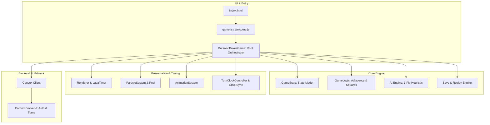

# Deep Codebase Audit & Remediation Plan — ShapeKeeper v4.3.0

> **Date:** 2026-08-21  
> **Author:** Antigravity Pairing Assistant  
> **Target Version:** ShapeKeeper v4.3.0+  
> **Status:** Pending User Approval  

---

## 1. Goal Description

ShapeKeeper is a zero-build browser-based Dots & Boxes territory capture game featuring real-time multiplayer via Convex backend, an offline AI opponent (Easy, Medium, Hard), a local save/replay engine, and particle/effect systems (including the newly shipped Lava Timer and clock sync lag resilience).

Following a rigorous, line-by-line inspection of the 960-line root orchestrator ([`dots-and-boxes-game.js`](file:///home/ewaldt/Documents/VS/GAMES/ShapeKeeper/dots-and-boxes-game.js)), state model ([`game-state.js`](file:///home/ewaldt/Documents/VS/GAMES/ShapeKeeper/game-state.js)), Convex client & backend mutations, animation/particle loops, UI manager, and the 117-test suite, this audit addresses 6 critical findings, technical debt, and test coverage gaps without introducing regressions.



---

## 2. User Review Required

> [!IMPORTANT]
> **Package.json ESM Definition & Vitest Warning**  
> `vitest.config.js` generates Node warning `[MODULE_TYPELESS_PACKAGE_JSON]` and a Vite `configLoader: 'native'` incompatibility warning because `package.json` lacks `"type": "module"`. We propose adding `"type": "module"` to `package.json` or renaming `vitest.config.js` to `vitest.config.mjs`.

> [!WARNING]
> **State Machine Property vs Method Collision (`isGameOver`)**  
> In [`src/ui/menu/syncHandlers.js:L213-214`](file:///home/ewaldt/Documents/VS/GAMES/ShapeKeeper/src/ui/menu/syncHandlers.js#L213-L214), online game completion sets `game.isGameOver = true`. However, throughout the rest of the codebase ([`game-state.js:L286`](file:///home/ewaldt/Documents/VS/GAMES/ShapeKeeper/game-state.js#L286), [`dots-and-boxes-game.js:L388`](file:///home/ewaldt/Documents/VS/GAMES/ShapeKeeper/dots-and-boxes-game.js#L388)), game over checks invoke `this.gameState.isGameOver()`. Overwriting `isGameOver` as a boolean directly on `game` causes polymorphism confusion. We will unify this so online completion sets state via `game.gameState.isGameOver()` and state properties consistently.

> [!NOTE]
> **Archiving Dead Triangle Planning Docs**  
> `Triangle/canvasBonusFeature.md` (1,806 lines) and `SHAPE_MESSAGES` in `constants.js` are artifacts of the removed triangle mechanic (net −2,152 lines in commit `ec051fb`). We propose moving the doc to `docs/archive/` and removing the unused `SHAPE_MESSAGES` constant.

---

## 3. Deep Audit Findings Matrix

| ID | Category | Severity | File(s) Affected | Description |
|---|---|---|---|---|
| **AUD-1** | **Bug / Typing** | Medium | [`src/ui/menu/syncHandlers.js`](file:///home/ewaldt/Documents/VS/GAMES/ShapeKeeper/src/ui/menu/syncHandlers.js#L213) | `game.isGameOver = true` conflicts with method `game.gameState.isGameOver()`. |
| **AUD-2** | **Test Gap** | High | [`dots-and-boxes-game.js`](file:///home/ewaldt/Documents/VS/GAMES/ShapeKeeper/dots-and-boxes-game.js#L476-L650) | ~160 lines of AI lookahead heuristics (`pickHardSafeLine`, `opponentBestGainAfter`, `evaluateSafeLineStrength`, `evaluateImmediateSquareGain`) have **0 dedicated unit tests**. |
| **AUD-3** | **Performance** | Low-Medium | [`particle-system/core.js`](file:///home/ewaldt/Documents/VS/GAMES/ShapeKeeper/particle-system/core.js#L11-L12), [`particle-system.js`](file:///home/ewaldt/Documents/VS/GAMES/ShapeKeeper/particle-system.js#L77-L80) | Ambient particles use hardcoded `width = 800; height = 600` on init instead of canvas dimensions. `spawnParticles` allocates a `new Set(this.particles)` on every spawn call. |
| **AUD-4** | **Config / Tooling**| Low | [`package.json`](file:///home/ewaldt/Documents/VS/GAMES/ShapeKeeper/package.json), [`vitest.config.js`](file:///home/ewaldt/Documents/VS/GAMES/ShapeKeeper/vitest.config.js) | Missing `"type": "module"` causes ESM reparsing overhead and Vite warning. |
| **AUD-5** | **Dead Code** | Low | [`constants.js`](file:///home/ewaldt/Documents/VS/GAMES/ShapeKeeper/constants.js#L255), `Triangle/` | Leftover `SHAPE_MESSAGES` (triangle strings) and unarchived 1,806-line doc. |
| **AUD-6** | **DOM Safety** | Low | [`effect-system/modal.js`](file:///home/ewaldt/Documents/VS/GAMES/ShapeKeeper/effect-system/modal.js#L65-L78) | InnerHTML injection in prompt rendering should use `textContent` to ensure strict XSS immunity. |

---

## 4. Open Questions

1. **AI Difficulty Benchmark Coverage**: Would you like us to add a fast, deterministic Monte-Carlo or scenario-based unit test suite for AI levels (`easy`, `medium`, `hard`) to prove `hard` consistently outperforms `easy` and avoids giving away double captures?
2. **Triangle Directory Archival**: Should `Triangle/canvasBonusFeature.md` be relocated to `docs/archive/canvasBonusFeature.md` or deleted outright?

---

## 5. Proposed Changes & Implementation Strategy

### Component 1: Configuration & Environment Fixes
Align ESM packaging and suppress Vite native config loader warnings.

#### [MODIFY] [`package.json`](file:///home/ewaldt/Documents/VS/GAMES/ShapeKeeper/package.json)
```json
{
  "name": "shapekeeper",
  "version": "4.3.0",
  "type": "module",
  ...
}
```

#### [MODIFY] [`vitest.config.js`](file:///home/ewaldt/Documents/VS/GAMES/ShapeKeeper/vitest.config.js)
Ensure clean native ESM resolution.

---

### Component 2: Core Logic & State Machine Hardening

#### [MODIFY] [`src/ui/menu/syncHandlers.js`](file:///home/ewaldt/Documents/VS/GAMES/ShapeKeeper/src/ui/menu/syncHandlers.js)
Fix `isGameOver` boolean vs method collision:
```javascript
// Before:
if (gameState.room?.status === 'finished' && !game.isGameOver) {
    game.isGameOver = true;
    game.showWinner();
}

// After:
if (gameState.room?.status === 'finished' && !game.gameOverHandled) {
    game.gameOverHandled = true;
    game.showWinner();
}
```

#### [MODIFY] [`particle-system/core.js`](file:///home/ewaldt/Documents/VS/GAMES/ShapeKeeper/particle-system/core.js)
Allow responsive dimensions for ambient particles:
```javascript
export function initializeAmbientParticles(system) {
    system.ambientParticles = [];
    const width = system.logicalWidth || 800;
    const height = system.logicalHeight || 600;
    for (let i = 0; i < GAME_CONSTANTS.AMBIENT_PARTICLE_COUNT; i++) {
        system.ambientParticles.push(createAmbientParticle(false, width, height));
    }
}
```

#### [MODIFY] [`effect-system/modal.js`](file:///home/ewaldt/Documents/VS/GAMES/ShapeKeeper/effect-system/modal.js)
Refactor prompt generation to use `document.createElement` and `textContent` instead of string interpolation inside `innerHTML`.

#### [MODIFY] [`constants.js`](file:///home/ewaldt/Documents/VS/GAMES/ShapeKeeper/constants.js)
Remove unused `SHAPE_MESSAGES` constant.

---

### Component 3: Test Suite Expansion (TDD)

#### [NEW] `tests/ai-engine.test.js`
Add comprehensive test suite covering:
1. **Easy AI**: Random move selection, probability check.
2. **Medium AI**: Greedily captures immediate squares; avoids making 3-edge squares.
3. **Hard AI (1-ply lookahead)**: Prefers safe lines that do not concede immediate multi-captures to the opponent (`opponentBestGainAfter`).
4. **Edge cases**: Grid saturation, zero available moves, AI turn token invalidation during rapid undo/redo.

#### [NEW] `tests/game-effects.test.js`
Expand test coverage for party mode & tile effects:
1. `frozenTurns`: Player skips turn and thawing occurs.
2. `bonusTurns`: Player receives consecutive turns.
3. `shieldCount` & `protectedSquares`: Prevents territory stealing.
4. `ghostLines`: Opacity and invisibility tracking.
5. `undoMove` / `redoMove`: Move snapshot integrity and AI cancelation.

---

## 6. Bite-Sized Milestone Breakdown

```mermaid
gantt
    title Codebase Audit & Hardening Milestones
    dateFormat X
    axisFormat %s

    section Milestone 1
    Config & ESM Module Fix :0, 1
    Dead Code Removal & Archiving :1, 2

    section Milestone 2
    State Machine & Sync Hardening :2, 4
    DOM Safety & Particle Pool Polish :4, 5

    section Milestone 3
    AI Engine Unit Tests (TDD) :5, 7
    Game Effects & Undo/Redo Tests :7, 9

    section Milestone 4
    Full Regression Verification :9, 10
```



### Task 1: Environment & Config Normalization
- Add `"type": "module"` to `package.json`.
- Verify `npm test`, `npm run lint`, `npx convex typecheck` run with zero warnings.

### Task 2: State Machine & Sync Consistency
- Fix `game.gameOverHandled` in `syncHandlers.js`.
- Clean up `particle-system/core.js` ambient dimensions.
- Sanitize modal prompt DOM creation in `effect-system/modal.js`.

### Task 3: Dead Code & Documentation Hygiene
- Remove obsolete `SHAPE_MESSAGES` in `constants.js`.
- Archive `Triangle/canvasBonusFeature.md` to `docs/archive/canvasBonusFeature.md`.

### Task 4: AI & Effect Test Suite Implementation
- Write `tests/ai-engine.test.js` with comprehensive scenarios.
- Write `tests/game-effects.test.js` testing undo/redo, snapshots, and effect states.

### Task 5: Verification & Walkthrough
- Execute Vitest suite (aiming for 130+ passing tests).
- Execute Playwright E2E smoke tests.
- Produce detailed Walkthrough artifact.

---

## 7. Verification Plan

### Automated Testing
```bash
# 1. Run full unit test suite
npm test

# 2. Run ESLint code quality scan
npm run lint

# 3. Run Convex TypeScript checks
npx convex typecheck

# 4. Run Playwright E2E tests
npm run test:e2e:smoke
```

### Manual Verification
- Launch local server (`npx http-server -p 8080 .`).
- Play an AI match on Hard mode: verify AI actively avoids 3rd edge of boxes unless forced.
- Test Undo and Redo during an active AI game: confirm no stuck "thinking" state.
- Verify online room synchronization and game completion modal trigger.
